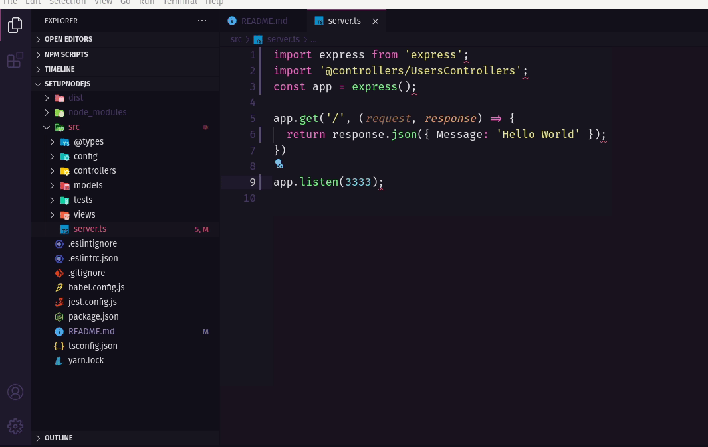

# Setup to apps Nodejs (Typescript,ESLint,Jest,Babel)

# Tecnologies

[Nodejs](https://nodejs.org/en/) 
[VScode](https://code.visualstudio.com/) with [EditorConfig](https://marketplace.visualstudio.com/items?itemName=EditorConfig.EditorConfig) and [ESLint](https://marketplace.visualstudio.com/items?itemName=dbaeumer.vscode-eslint), [Jest](https://jestjs.io/),[Babel](https://babeljs.io/)